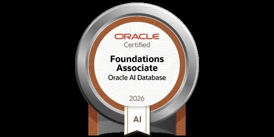

# Hi, I'm Karra Madhuri 👋

**Computer Science Graduate · Full Stack Development · Java & Python**

Hyderabad, India · Open to fresher software development opportunities

[Projects](#selected-projects) · [Skills](#technical-skills) · [Certification](#certification) · [Contact](#contact)

---

## About me

I'm a 2026 Computer Science and Engineering graduate from KITS, Warangal. I enjoy building practical applications, solving problems, and learning new technologies.

- **Interests:** Full stack development, Python applications, and AI/ML.
- **Internship exposure:** Java, Python, Web Development, Full Stack Development, AI/ML, Android Development, and Software Development.
- **Looking for:** Entry-level Software Developer, Full Stack, Java, or Python roles in Hyderabad or remote opportunities in India.

## Selected projects

| Project | Overview | Technologies |
| --- | --- | --- |
| [Karra's Food](https://github.com/Madhurikarra2035/Karras-food-python) | Restaurant website with menu, about, and reservation pages. | Python, FastAPI, Jinja2, HTML, CSS, JavaScript |
| [CivicConnect](https://github.com/Madhurikarra2035/Civic-Connect-app) | Civic issue reporting and resolution tracking project for Hyderabad communities. | TypeScript, Node.js, Express, PostgreSQL |
| [ATM Simulator](https://github.com/Madhurikarra2035/ATM-project) | Console application with PIN verification, balance checks, deposits, and withdrawals. | Python |

[Explore all repositories →](https://github.com/Madhurikarra2035?tab=repositories)

## Technical skills

| Area | Skills |
| --- | --- |
| Languages | Java, Python, JavaScript, SQL |
| Frontend | HTML, CSS, React.js |
| Backend | Node.js, Express.js, Flask, REST APIs |
| Databases | MySQL, SQLite |
| Tools & foundations | Git, GitHub, OOP, Data Structures |
| Learning focus | Machine Learning, Generative & Agentic AI |

## Certification

**Oracle AI Database Foundations Associate — 2026**

## Contact

[LinkedIn](https://www.linkedin.com/in/Madhurikarra2035) · [Email](mailto:karramadhuri2003@gmail.com)

I'm open to opportunities and collaboration on useful software projects.
